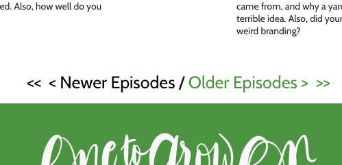

On the site for my podcast, [One to Grow On](https://onetogrowonpod.com), we used to have pagination links.



This was fine to get the site up and running. Before long, however, I felt the mechanism that pagniation links provided was too tedious and I needed to replace them with something else. I have almost never had a good experience with infinite scroll, so that was out as an option. I had seen a few "More" buttons on other websites and decided that was the way to go. Here is the code from my `index.js` file:

```jsx
const episodes = React.useMemo(() => {
  return group.filter(({ node }) => {
    const isEpisode = node.categories.filter((category) => category?.slug === 'episodes').length > 0
    return isEpisode
  })
}, [group])

const MAX_POSTS = episodes.length

const setPostNum = () => {
  setPostLimit((prevPostLimit) => {
    let newPostLimit = prevPostLimit + 6
    newPostLimit = newPostLimit >= MAX_POSTS ? MAX_POSTS : newPostLimit
    return newPostLimit
  })
}

const [postLimit, setPostLimit] = React.useState(9)

const shownPosts = episodes.slice(0, postLimit)
```

There&rsquo;s quite a bit going on here, so let&rsquo;s dig in.

On line 2 I filter out all of the posts that are categorized as podcast episodes. Using `React.useMemo` means that the filtering won&rsquo;t happen on each render.
