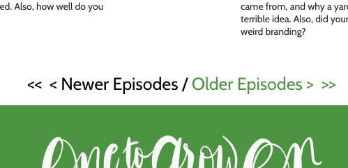

On the site for my podcast, [One to Grow On](https://onetogrowonpod.com), we used to have pagination links.



This was fine to get the site up and running. Before long, however, I felt the mechanism that pagniation links provided was too tedious and I needed to replace them with something else. I have almost never had a good experience with infinite scroll, so that was out as an option. I had seen a few "More" buttons on other websites and decided that was the way to go. Here is the code from my `index.js` file:

```jsx
// edges comes off of the props and is all posts filtered by category
const MAX_POSTS = edges.length

const setPostNum = () => {
  setPostLimit((prevPostLimit) => {
    let newPostLimit = prevPostLimit + 6
    newPostLimit = newPostLimit >= MAX_POSTS ? MAX_POSTS : newPostLimit
    return newPostLimit
  })
}

const [postLimit, setPostLimit] = React.useState(9)

// previewlinks is the final list of posts previews to display
const shownPosts = previewLinks.slice(0, postLimit)
```

Then there's a button that triggers `setPostNum` to increase the limit shown:

```jsx
// MoreButton is a styled component created with Emotion
<MoreButton type="button" onClick={setPostNum} disabled={postLimit >= MAX_POSTS}>
  {postLimit >= MAX_POSTS ? <span>That&rsquo;s it!</span> : 'More...'}
</MoreButton>
```

That&rsquo;s it for the basic functionality. In the TODO column I put changing the number of posts displayed based on the screen width.

I did take one more step. I didn't think the entire list of post previews should be regenerated each time a user hit the more button.

```jsx
// PreviewLink is a styled component created with Emotion
const previewLinks = React.useMemo(() => {
  return edges.map(({ node }) => {
    const bgUrl = node.featuredImage
      ? node.featuredImage.node.localFile?.childImageSharp.fixed.src
      : ''
    return (
      <PreviewLink
        key={node.id}
        uri={node.uri}
        slug={node.slug}
        title={node.title}
        date={node.date}
        excerpt={node.excerpt}
        bgUrl={bgUrl}
      />
    )
  })
}, [edges])
```

This may be, as the kids say these days, a premature optimization. `useMemo` is supposed to be used for expensive calculations, and a simple map hardly seems expensive. Nevertheless, reducing unnecessary re-renders always seems like a good thing.
